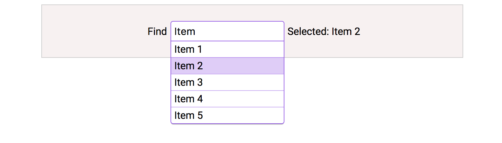

# reactjs-search-box
Search box using reactjs

## Installation

import ReactJsSearchBox from 'reactjs-search-box';

## Usage

    - Step 1: Include this on loader module 
    - Step 2: 
        <ReactJsSearchBox ref={ref => this.reactJsSearchBox = ref}
                options={{ label: '', placeHolder: 'search' }} />

## Capture
  

## Tests

  npm install  
  npm test

## Deverlopment

  npm install  
  npm run build:dev  
  open http://localhost:6996

## Contributing

In lieu of a formal styleguide, take care to maintain the existing coding style.  
Add unit tests for any new or changed functionality. Lint and test your code.

## Release History

* 1.0.0 Initial release
* 1.1.0 Test, example, built
* 1.1.1 Search with local datas


  - Initial component with local datas
  - Open match result with text input search
  - Example css for demo
* 1.1.2 Built
* 1.2.0 Support selected item with result and hover/selected style

<!-- # [DEMO](https://cdn.rawgit.com/lequangphuong/reactjs-search-box/9ee1c807/dist/index.html)  -->
